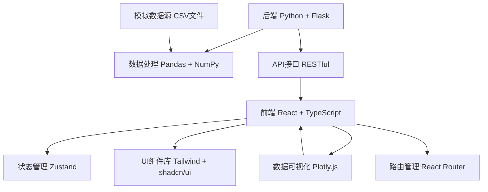
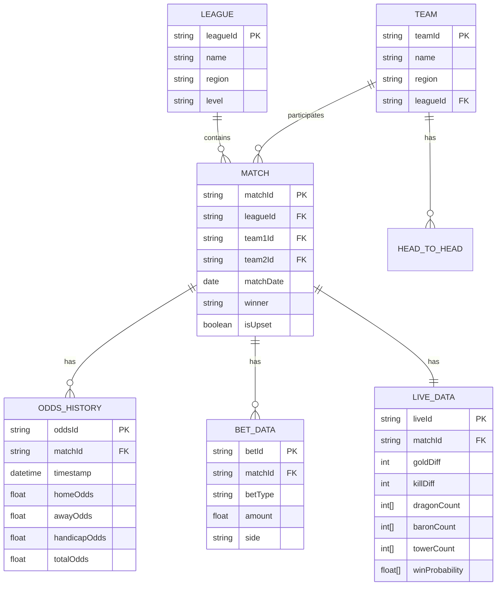

## 1. 架构设计

本项目采用前后端分离架构，前端使用React构建响应式数据看板，后端使用Python处理数据和提供API接口，数据存储采用CSV文件模拟。



## 2. 技术栈说明

| 层级 | 技术选型 | 版本 | 用途 |
|------|----------|------|------|
| 前端框架 | React | 18.x | 用户界面构建 |
| 前端语言 | TypeScript | 5.x | 类型安全 |
| 构建工具 | Vite | 5.x | 开发和构建 |
| 路由 | react-router-dom | 6.x | 页面路由 |
| 状态管理 | zustand | 4.x | 全局状态 |
| UI框架 | Tailwind CSS | 3.x | 样式系统 |
| UI组件 | shadcn/ui | latest | 基础组件 |
| 图表库 | plotly.js | 2.x | 数据可视化 |
| 图表封装 | react-plotly.js | 2.x | React Plotly集成 |
| 图标 | lucide-react | latest | 图标组件 |
| 后端框架 | Flask | 3.x | API服务 |
| 数据处理 | Pandas | 2.x | 数据分析 |
| 数据处理 | NumPy | 1.x | 数值计算 |
| 数据源 | CSV | - | 模拟数据 |

## 3. 路由定义

| 路由路径 | 页面名称 | 主要功能 |
|----------|----------|----------|
| `/` | 总览仪表盘 | 核心指标概览、快速导航 |
| `/bet-distribution` | 投注分布分析 | 各联赛各玩法投注分布 |
| `/odds-tracking` | 赔率变动追踪 | 赔率曲线、异常检测 |
| `/upset-analysis` | 爆冷分析 | 赛区爆冷率对比、历史案例 |
| `/team-history` | 战队交锋分析 | 对战历史、胜率统计 |
| `/live-analysis` | 实时滚球分析 | 实时胜率、价值机会 |

## 4. 前端目录结构

```
src/
├── components/           # 公共组件
│   ├── charts/          # Plotly图表组件
│   ├── layout/          # 布局组件（Sidebar, Header）
│   └── ui/              # shadcn/ui基础组件
├── pages/               # 页面组件
│   ├── Dashboard.tsx
│   ├── BetDistribution.tsx
│   ├── OddsTracking.tsx
│   ├── UpsetAnalysis.tsx
│   ├── TeamHistory.tsx
│   └── LiveAnalysis.tsx
├── hooks/               # 自定义Hooks
│   ├── useFetchData.ts
│   └── useWebSocket.ts  # 模拟实时数据
├── store/               # Zustand状态管理
│   └── useDataStore.ts
├── utils/               # 工具函数
│   ├── formatters.ts
│   └── calculations.ts
├── types/               # TypeScript类型定义
│   └── index.ts
├── App.tsx
├── main.tsx
└── index.css
```

## 5. 后端目录结构

```
api/
├── app.py               # Flask应用入口
├── data_loader.py       # CSV数据加载
├── analysis/            # 分析模块
│   ├── bet_analysis.py
│   ├── odds_analysis.py
│   ├── upset_analysis.py
│   ├── team_analysis.py
│   └── live_analysis.py
└── routes/              # API路由
    ├── bet_routes.py
    ├── odds_routes.py
    ├── upset_routes.py
    ├── team_routes.py
    └── live_routes.py
```

## 6. API接口定义

### 6.1 投注分布接口

```typescript
// GET /api/bet-distribution?league=lck
interface BetDistributionResponse {
  league: string;
  totalAmount: number;
  betTypes: {
    type: 'home_win' | 'away_win' | 'handicap' | 'total' | 'first_kill' | 'first_turret';
    amount: number;
    percentage: number;
  }[];
  heatMapData: number[][];
}
```

### 6.2 赔率追踪接口

```typescript
// GET /api/odds-tracking?matchId=xxx
interface OddsTrackingResponse {
  matchId: string;
  matchName: string;
  oddsHistory: {
    timestamp: string;
    homeOdds: number;
    awayOdds: number;
  }[];
  anomalies: {
    timestamp: string;
    changePercent: number;
    type: 'home' | 'away';
    description: string;
  }[];
}
```

### 6.3 爆冷分析接口

```typescript
// GET /api/upset-analysis
interface UpsetAnalysisResponse {
  regionStats: {
    region: string;
    regionLevel: 'major' | 'wildcard';
    totalMatches: number;
    upsetCount: number;
    upsetRate: number;
  }[];
  upsetHistory: {
    matchId: string;
    date: string;
    league: string;
    favorite: string;
    underdog: string;
    winner: string;
    upsetMagnitude: number;
  }[];
}
```

### 6.4 战队交锋接口

```typescript
// GET /api/team-history?team1=xxx&team2=xxx
interface TeamHistoryResponse {
  team1: string;
  team2: string;
  totalMatches: number;
  team1Wins: number;
  team2Wins: number;
  avgBo3Duration: number;
  fullSetRate: number;
  matchHistory: {
    date: string;
    winner: string;
    score: string;
    duration: number;
  }[];
}
```

### 6.5 实时滚球接口

```typescript
// GET /api/live-analysis
interface LiveAnalysisResponse {
  liveMatches: {
    matchId: string;
    team1: string;
    team2: string;
    currentScore: [number, number];
    gameTime: string;
    goldDiff: number;
    killDiff: number;
    dragonCount: [number, number];
    baronCount: [number, number];
    towerCount: [number, number];
    winProbability: [number, number];
    currentOdds: [number, number];
    valueBet?: {
      side: 'team1' | 'team2';
      edge: number;
      recommendation: string;
    };
  }[];
}
```

## 7. 数据模型

### 7.1 实体关系图



### 7.2 CSV数据文件结构

- `data/matches.csv` - 赛事基本信息
- `data/teams.csv` - 战队信息
- `data/leagues.csv` - 联赛信息
- `data/odds_history.csv` - 赔率历史数据
- `data/bet_distribution.csv` - 投注分布数据
- `data/head_to_head.csv` - 战队交锋历史
- `data/live_matches.csv` - 实时比赛数据
- `data/upset_history.csv` - 爆冷历史数据

## 8. 核心算法

### 8.1 异常赔率检测

```python
def detect_anomaly(odds_history: pd.DataFrame, threshold: float = 0.3) -> list:
    """
    检测赔率异常变动（超过30%）
    """
    anomalies = []
    for col in ['homeOdds', 'awayOdds']:
        pct_change = odds_history[col].pct_change()
        anomaly_mask = pct_change.abs() > threshold
        for idx in odds_history[anomaly_mask].index:
            anomalies.append({
                'timestamp': idx,
                'changePercent': pct_change[idx],
                'type': 'home' if col == 'homeOdds' else 'away',
                'description': f'{col}变动{pct_change[idx]*100:.1f}%'
            })
    return anomalies
```

### 8.2 实时胜率计算

```python
def calculate_win_probability(
    gold_diff: int,
    kill_diff: int,
    dragon_diff: int,
    baron_diff: int,
    tower_diff: int,
    game_time: int
) -> tuple[float, float]:
    """
    基于多因素加权模型计算实时胜率
    """
    weights = {
        'gold': 0.35,
        'kill': 0.25,
        'dragon': 0.15,
        'baron': 0.15,
        'tower': 0.10
    }
    
    # 归一化处理
    normalized = {
        'gold': np.tanh(abs(gold_diff) / 5000) * np.sign(gold_diff),
        'kill': np.tanh(abs(kill_diff) / 10) * np.sign(kill_diff),
        'dragon': np.tanh(abs(dragon_diff) / 3) * np.sign(dragon_diff),
        'baron': np.tanh(abs(baron_diff) / 2) * np.sign(baron_diff),
        'tower': np.tanh(abs(tower_diff) / 5) * np.sign(tower_diff)
    }
    
    score = sum(weights[k] * normalized[k] for k in weights)
    prob_team1 = 1 / (1 + np.exp(-score * 3))
    
    return prob_team1, 1 - prob_team1
```

### 8.3 价值投注识别

```python
def identify_value_bet(
    win_probability: tuple[float, float],
    current_odds: tuple[float, float],
    threshold: float = 0.05
) -> dict | None:
    """
    识别价值投注机会（隐含胜率 vs 模型胜率）
    """
    implied_probs = (1 / current_odds[0], 1 / current_odds[1])
    edges = (
        win_probability[0] - implied_probs[0],
        win_probability[1] - implied_probs[1]
    )
    
    if edges[0] > threshold:
        return {
            'side': 'team1',
            'edge': edges[0],
            'recommendation': f'建议投注主队，价值边缘{edges[0]*100:.1f}%'
        }
    elif edges[1] > threshold:
        return {
            'side': 'team2',
            'edge': edges[1],
            'recommendation': f'建议投注客队，价值边缘{edges[1]*100:.1f}%'
        }
    return None
```
