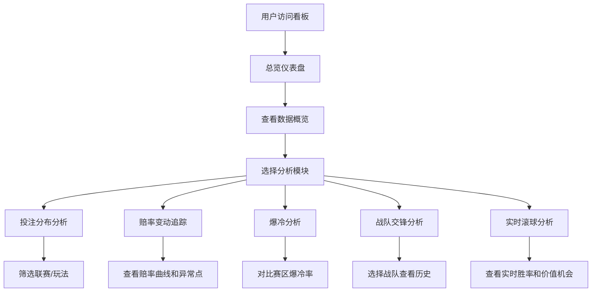

## 1. 产品概述

电竞赛事投注数据分析看板是一款面向电竞投注爱好者和专业分析师的综合性数据决策支持平台，通过多维度数据可视化和智能分析模型，帮助用户洞察赛事投注趋势、识别价值机会、提升投注决策的准确性和收益率。

- 核心价值：将复杂的赛事数据、赔率变动、历史交锋等信息转化为直观的可视化图表和可操作的洞察
- 目标用户：电竞投注爱好者、专业数据分析员、赛事预测博主
- 覆盖赛事：英雄联盟LPL/LCK等主流联赛及外卡赛区

## 2. 核心功能

### 2.1 功能模块清单

| 序号 | 模块名称 | 核心价值 |
|------|----------|----------|
| 1 | 赛事投注分布分析 | 展示各联赛各玩法的资金流向和热度分布 |
| 2 | 赔率变动追踪系统 | 24小时赔率曲线监控，异常跳水自动预警 |
| 3 | 热门vs冷门赛事分析 | 赛区爆冷率对比，历史爆冷案例查询 |
| 4 | 战队交锋历史分析 | 对战数据统计，胜率与趋势分析 |
| 5 | 实时滚球数据分析 | 实时胜率计算，价值投注机会识别 |

### 2.2 页面详情

| 页面名称 | 模块名称 | 功能描述 |
|----------|----------|----------|
| 总览仪表盘 | 数据概览卡片 | 今日赛事、投注总额、热门赛事、爆冷预警等核心指标速览 |
| 总览仪表盘 | 快速导航区 | 五大功能模块入口，支持一键跳转 |
| 投注分布页 | 联赛筛选器 | 按联赛/赛事维度筛选数据 |
| 投注分布页 | 投注类型分布饼图 | 主队胜、客队胜、让分盘、大小盘、首杀、首塔等玩法占比 |
| 投注分布页 | 资金流向热力图 | 各玩法资金热度可视化 |
| 赔率追踪页 | 赛事选择器 | 选择具体比赛查看赔率曲线 |
| 赔率追踪页 | 24小时赔率曲线图 | 赛前24小时赔率变动趋势可视化 |
| 赔率追踪页 | 异常变动标注 | 赔率变动超30%自动标红，显示时间节点和幅度 |
| 爆冷分析页 | 赛区爆冷率对比 | LCK/LPL等主流赛区与外卡赛区爆冷率对比柱状图 |
| 爆冷分析页 | 爆冷赛事列表 | 历史爆冷赛事查询，支持筛选和搜索 |
| 战队分析页 | 战队选择器 | 选择两支战队查看交锋历史 |
| 战队分析页 | 交锋统计卡片 | 胜率、BO3时长均值、打满场次比例等指标 |
| 战队分析页 | 历史对战趋势图 | 对战结果时间序列可视化 |
| 滚球分析页 | 实时比赛列表 | 正在进行的比赛列表及当前状态 |
| 滚球分析页 | 实时胜率仪表盘 | 基于经济差、击杀比、资源控制的动态胜率计算 |
| 滚球分析页 | 价值机会提示 | 实时胜率与滚球赔率对比，识别价值投注 |

## 3. 核心用户流程

用户进入看板后，首先在总览页查看今日核心数据概览，然后根据具体需求导航至对应分析模块：

## 4. 用户界面设计

### 4.1 设计风格
- **设计方向**：科技感电竞风格，深色主题为主，搭配霓虹色高亮元素
- **主色调**：深海军蓝 `#0a0e1a`，搭配电竞蓝 `#3b82f6` 和电竞绿 `#10b981`
- **强调色**：预警红 `#ef4444`（异常标注）、金色 `#f59e0b`（价值提示）
- **字体**：展示字体使用 `Orbitron`（电竞风格），正文字体使用 `Inter`
- **布局**：卡片式网格布局，支持响应式适配
- **视觉效果**：玻璃态卡片、渐变边框、微妙的发光效果

### 4.2 页面设计概述

| 页面名称 | 模块名称 | UI元素特点 |
|----------|----------|------------|
| 总览仪表盘 | 数据概览卡片 | 玻璃态效果、数据动画入场、悬停发光 |
| 总览仪表盘 | 导航卡片 | 图标+渐变背景、hover上浮效果 |
| 投注分布页 | 饼图/环形图 | Plotly交互式、悬停显示详情 |
| 赔率追踪页 | 赔率曲线图 | 异常点红色标记、点击弹窗显示详情 |
| 爆冷分析页 | 对比柱状图 | 分组对比、不同颜色区分赛区级别 |
| 战队分析页 | 统计指标卡 | 左右对称布局、对比色区分两队 |
| 滚球分析页 | 实时仪表盘 | 动态更新、胜率进度条、价值标签闪烁提示 |

### 4.3 响应式设计
- **桌面端**（1200px+）：三列网格布局，完整展示所有图表
- **平板端**（768px-1199px）：两列布局，次要图表折叠显示
- **移动端**（<768px）：单列流式布局，支持横向滚动浏览图表

### 4.4 动效设计
- 页面加载：卡片错落入场动画（staggered reveal）
- 数据更新：数字滚动变化、图表平滑过渡
- 异常预警：红色脉冲动画提示
- 价值机会：金色呼吸灯效果
- 导航切换：平滑过渡动画
